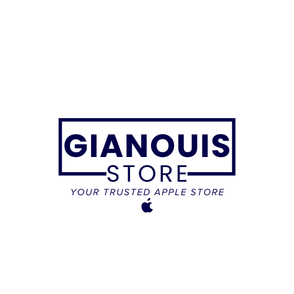
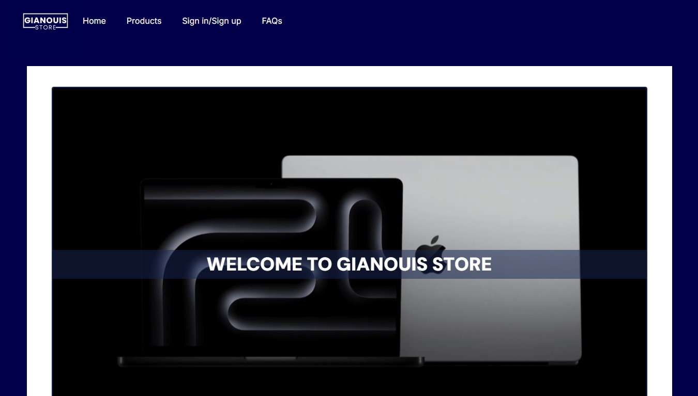
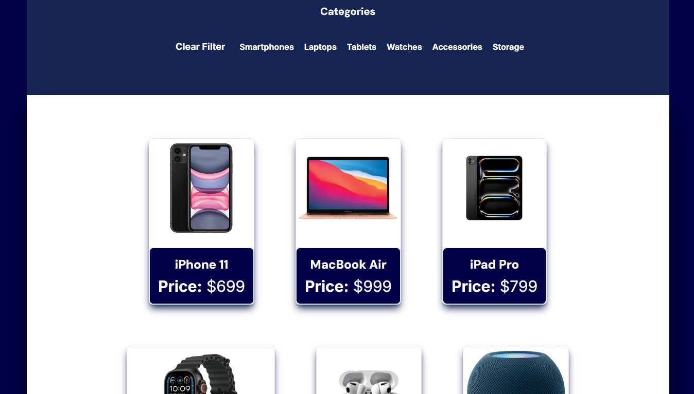
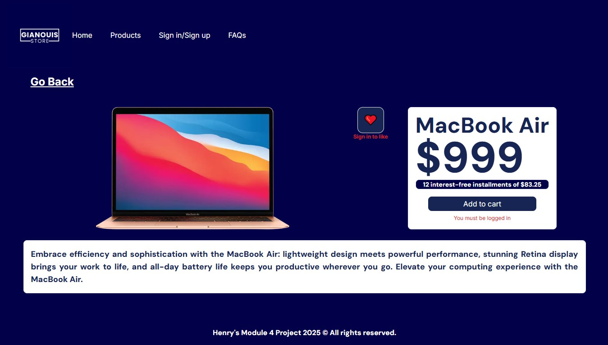
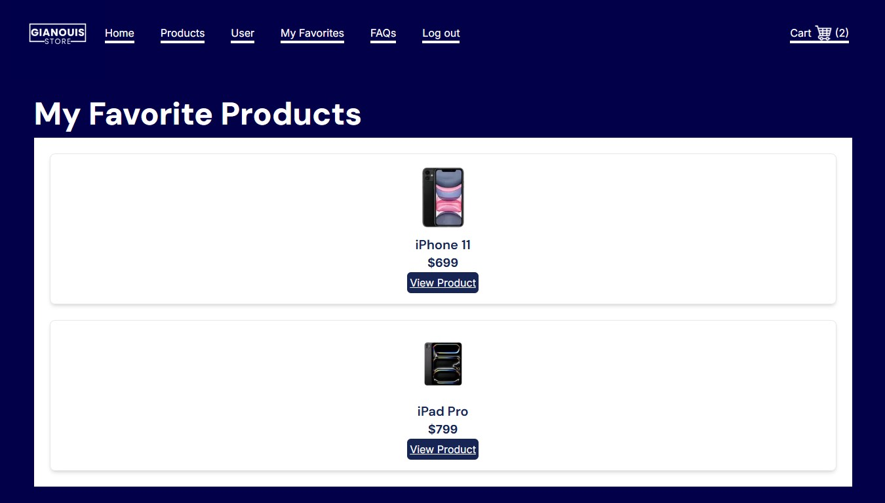
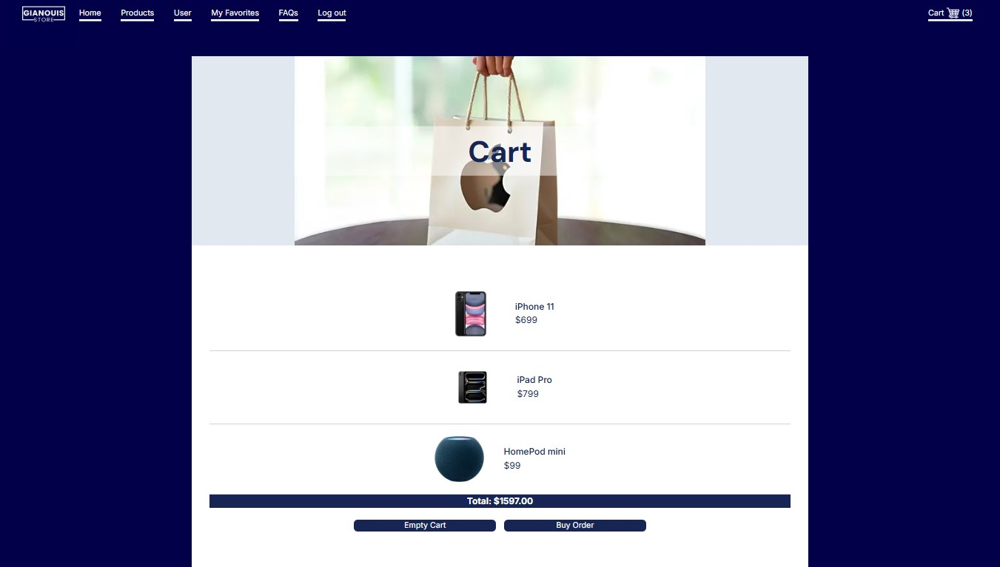
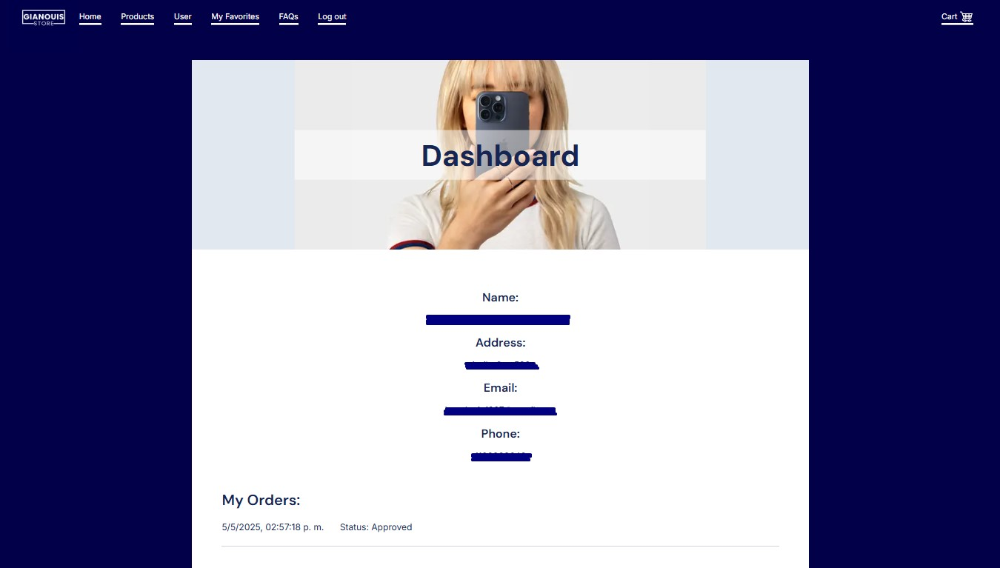

# Gianouis Store- Proyecto del Modulo 4
Este es el proyecto del Modulo 4 presentado en Henry, el cual realicé en solitario. En este proyecto utilizamos PostgreSQL para la base de datos, y en el front trabajamos con Next.js, TypeScript y TailwindCSS.

  

**Gianouis Store** es una plataforma Ecommerce diseñada para la venta y distribución  Dicha plataforma cuenta con diseño responsive.
  
El proyecto se encuentra deployado y disponible para su visita. Cabe mencionar que su back aún no se encuentra deployado, por lo cual no es posible completar algunas funcionalidades.

- https://front-test-m4.vercel.app

## Vista previa

  
   
  
   
  
   
  
   
  
   
  

